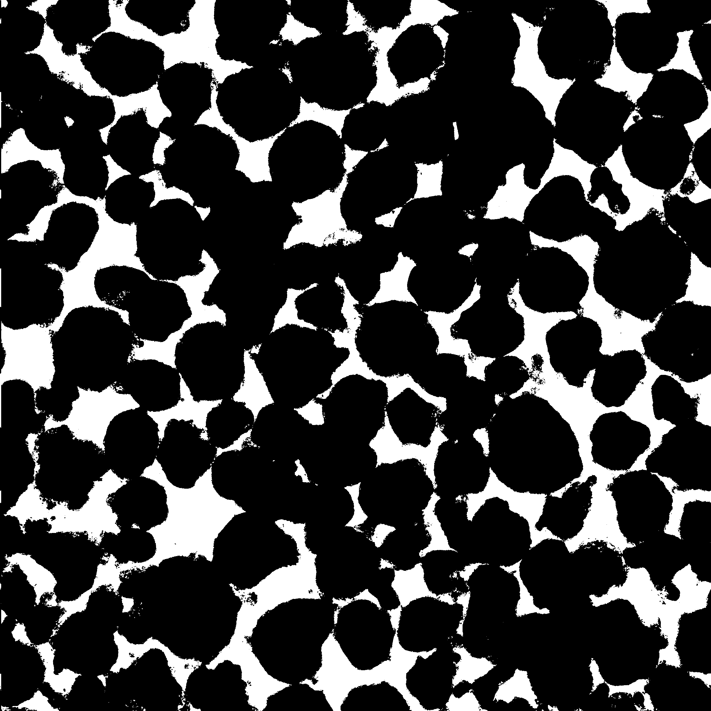
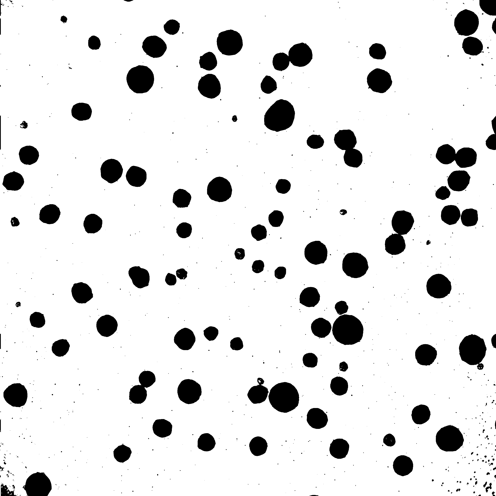
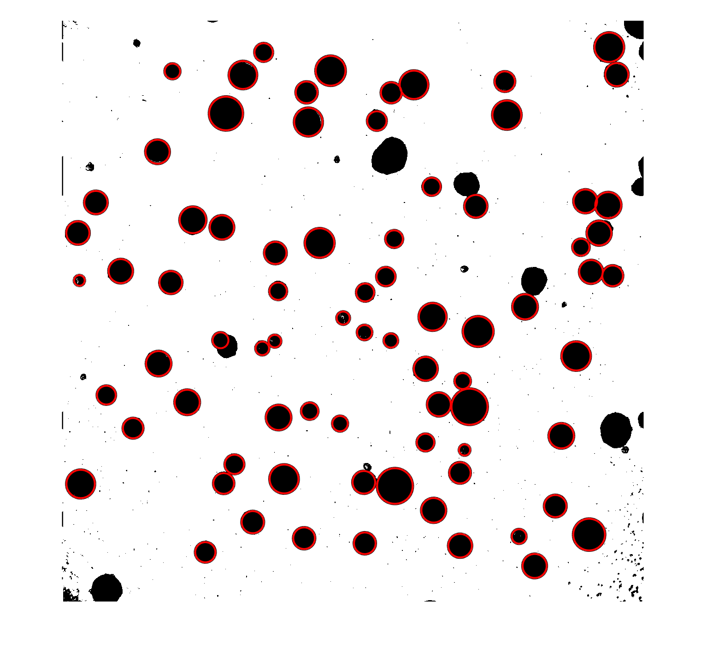
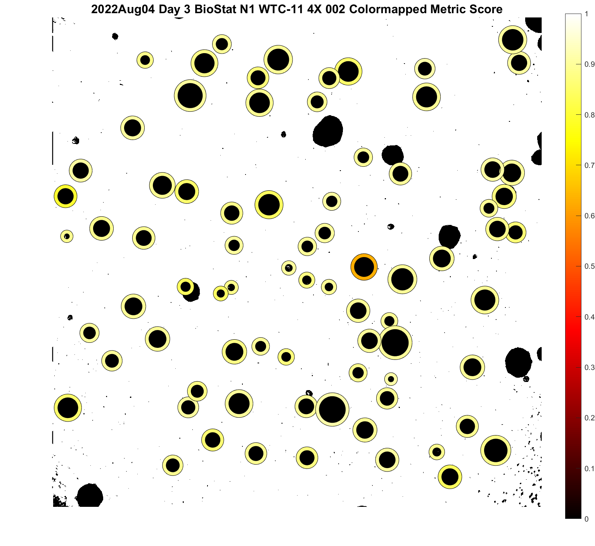
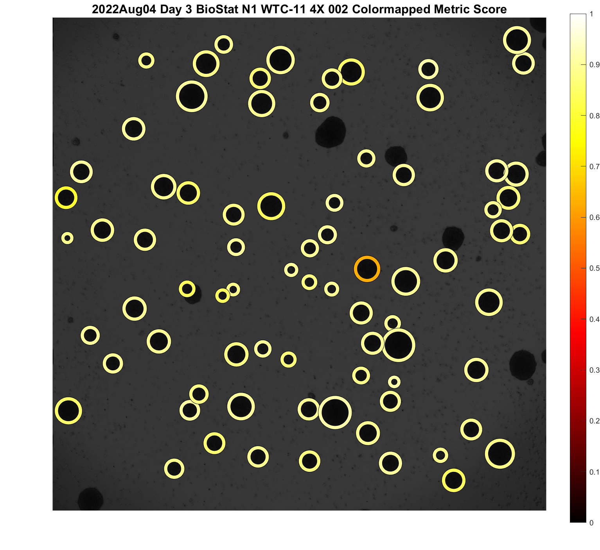

Code for Visual Analysis for EB Images. 

Supplementary Info for "Optimizing embryoid body culture in an automated bioreactor for the large-scale production of wholly-cellular bioinks" 
Authors: Debbie L. L. Ho, Stacey Lee, Jianyi Du, Tony Tam, Soham Sinha, Sean Devine, Art Hamfeldt, Jonathan D. Weiss, Hope T. Leng, Danielle Klinger, Mengdi He, Donald Traul, Quentin Vicard, Kishore Katikireddy, Mark A. Skylar-Scott

Code Maintenance: Soham Sinha (sohams@stanford.edu)

Navigation of Files:

1. **GeneralDay.m** operates on nd2 images directly existing in a directory. It scans the directory for all nd2 images, and analyses the images based on the settings provided. 

	Relevant Helper Functions: nd2info.m and nd2read.m (Citation: Chao-Yen Yuh’s nd2read (https://github.com/joe-of-all-trades/nd2read))

	**Note: For best results with computation time and accuracy, it is best to use an image that its not too dense with EBs**

	This is extremely dense of an image - the image can be segmented, but computation times skyrocket: 

	

	Pipeline of GeneralDay.m with an ideal example image. 

	First it converts the nd2 image to a color and black and white png images: 

	

	Second it segments the bw image (red circles denote found EBs using the current settings (range and sensitivity) and scan number)
		
	

	Finally, it will calculate the circularity scores and the boundary color of the EBs denote the circularity score for both bw and color - heatmap is provided to the side of the image. 
		
	 

	Rescan with different settings to capture other remaining EBs, as necessary. 

	Relevant Function Details are provided in the file description but also reproduced here: 

	Reproduced here for clarity:
	```
	function GeneralDay(LL, range, sensitivity)
	%%%LL responds to which scan your doing of the files (1st, 2nd, or 3rd)
	%%%Range is the sizes of EBs that you are searching for in pixel diameters - is a 2x1 vector with
	%%%[smallest_diameter largest_diameter];
	%%%Sensitivity (0-1) s a hyperparameter for choosing for which EB to select for
	%%%(higher sensitivities are needed for bigger EBs)
	%%% Recommendations for Range and Sensitivity

	%Start with [20 200], 0.72
	%Then with [40 200] 0.76
	%Then with [60 200] 0.80
	%Then [80 200] 0.88
	%Then with [90 200] with 0.92

	%Naming Conventions is based on the File Name given. 

	%Function will show analysis of images as they happen. 
	%Key outputs 
	%1. BW Image [Image Name will be appended with BW.png]
	%2. Color Image [Image Name will be appended with color.png]
	%3. Segmented BW Image [Image Name will be appended with clean.png]
	%4. Segmented BW Image with Circularity Map [Image Name will be appended with colormappedBW.png]
	%5. Segmented Color Image with Circularity Bars [Image Name will be appended with colormapped.png]
	%6. Text file with the following format of the columns of the numbers of
	%identified EBs
	%[Center_x Center_y Diameter Circularity]
	%7. Function will ask you which Day and Run (N) you are analysing - and use
	%these to output a text file with all EB diameters and circularity scores.
	%The diameter text file will have name of (Run)_(Day).txt.
	%The circularity text file will have name of (Run)_(Day)circle.txt.
	%Function will remove any repeats as necessary per increasing scan of
	%image. 

	```

2. **ViolinPlotter.m** operates on text files generated from GeneralDay to plot ViolinPlots - based on  2016, Bastian Bechtold Violin.m code. Violin Plotter Generates violin plots of data of both circularity and diameter of EBs. 

	Relevant Helper Functions Violin.m and violinplot.m (Citation: Bechtold, Bastian, 2016. https://github.com/bastibe/Violinplot-Matlab, DOI: 10.5281/zenodo.4559847)
	

3. **Development_Scripts** contain scripts and images that were used during development of above code. It is not recommended to use these scripts, but placed here for full clarity and development. 

If you want to cite this repository, please cite the relevant paper.
